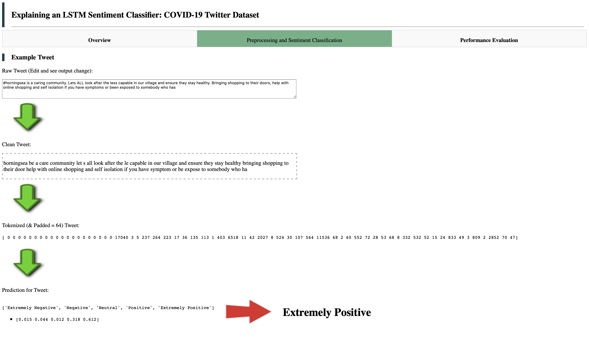

# explaining_LSTM_sentiment_classifier

This repo intends to visually explain an LSTM twitter sentiment classifier via an interactive python dash dashboard.

---
## Sample Output
---

---
## Usage
---
### 1. Data 
The data used for this analysis is sourced from kaggle: [Coronavirus tweets NLP - Text Classification](https://www.kaggle.com/datatattle/covid-19-nlp-text-classification?select=Corona_NLP_train.csv). The data, along with processed data (after cleaning) is stored in this repo under assets/data/ for convenience.

### 2. Environment
Please prepare an environment with python==3.8.0, and then use the command "pip install -r requirements.txt" for the dependencies. Note these dependencies in the requirements.txt are not as lean as they could be as this environment is set up to work for multiple tobycassidy repos. 

### 3. Run
Once the environment has been configured, run the command "python app.py" and after the script has run (~5 mins) the dashboard will be hosted on your localhost on port 8889. 
